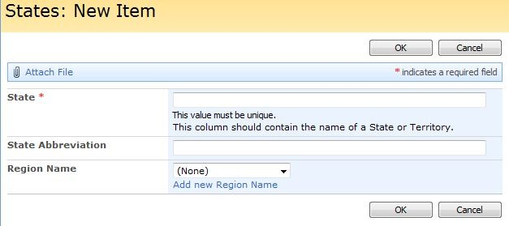

## Function

**$().SPServices.SPRequireUnique**

## Certification

[](../glossary/index.md#Certification) [](../glossary/index.md#Certification)

## Functionality

Checks to see if the value for a column on the form is unique in the list. The idea for this function came from testing [$().SPServices.SPCascadeDropdowns](SPCascadeDropdowns.md). When using lists like relational tables, you want to be sure that at least one column contains unique values. Currently, the function works only with Single line of text columns, and will generally be used with the Title column. There is considerable flexibility in the use of this function based on the combination of options and the ability to change the messages and their formatting.

Note that this function will work on the NewForm and EditForm for a list, but not in the datasheet view. The intent is to put some rigor around the normal item creation process. Because this is a client-side function, it does not pervasively enforce the uniqueness rule.

## Prerequisites

* None

## Syntax

``` javascript
$().SPServices.SPRequireUnique({
  columnStaticName: "Title",
  duplicateAction: 0,
  ignoreCase: false,
  initMsg: "This value must be unique.",
  initMsgCSSClass: "ms-vb",
  errMsg: "This value is not unique.",
  errMsgCSSClass: "ms-formvalidation",
  showDupes: false,
  completefunc: null
});
```

### columnStaticName

The [StaticName](../glossary/index.md#StaticName) of the column on the form. The default value is "Title".

### duplicateAction

This indicates what should happen if the user enters a value which already exists. The default is 0 (warn).

* 0 = warn means that a warning message will be placed on the screen, but the user can save the item
* 1 = prevent means that a warning message will be placed on the screen and the user will be prevented from saving the item (the OK button will be disabled until a unique value is entered)

### ignoreCase
If set to true, the function ignores case, if false it looks for an exact match. The default is false.

### initMsg
The initial message to display after setup. The message is displayed below in input control, but above the column description, if any. The default value is "This value must be unique."

### initMsgCSSClass
The CSS class for the initial message specified in initMsg. The default value is "ms-vb".

### errMsg
The error message to display if the value is not unique. The message is displayed below in input control, but above the column description, if any. (This is the same location as the initMsg.) The default value is "This value is not unique."

### errMsgCSSClass
The CSS class for the error message specified in errMsg. The default value is "ms-formvalidation".

### showDupes
If true, the function will show the other items in the list which are duplicates as links so that one can easily research what they are and potentially clean them up.

### completefunc
If specified, the completefunc will be called upon successful completion of the call to SPRequireUnique. Potential uses for the completefunc: consistent default formatting overrides, additional lookup customizations, image manipulations, etc. You can pass your completefunc in either of these two ways:

``` javascript
completefunc: function() {
  ...do something...
},
```

or

``` javascript
completefunc: doSomething,                  // Where doSomething is the name of your function
```

## Example

The following example will require the Title column to be unique.

``` html
<script language="javascript" type="text/javascript" src="../../jQuery%20Libraries/jquery-1.3.2.min.js"></script>
<script language="javascript" type="text/javascript" src="../../jQuery%20Libraries/jquery.SPServices-0.4.6.min.js"></script>
<script language="javascript" type="text/javascript">
	$(document).ready(function() {
		$().SPServices.SPRequireUnique({
			columnStaticName: "Title",
			duplicateAction: 0,
			ignoreCase: "false",
			initMsg: "This value must be unique.",
			initMsgCSSClass: "ms-vb",
			errMsg: "This value is not unique.",
			errMsgCSSClass: "ms-formvalidation"
		});
	});
</script>
```

This screenshot shows how the initMsg is displayed below the State column (State is the DisplayName for the Title column in this list):



This screenshot shows the errMsg being displayed because the value 'Alabama' already exists in the State column of an existing item. Note also that the OK buttons are disabled, preventing the user from saving the duplicate value.  


And with showDupes set to true:


